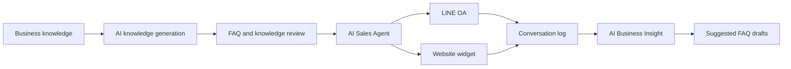

# AI Sales Companion

> **Every Conversation Makes You Grow**

AI Sales Companion is an OpenAI Build Week MVP that lets any business create an AI-powered sales agent in minutes. Describe the business, upload product or store photos, or provide a website; the platform turns that knowledge into FAQs and deploys the agent to LINE Official Account and a website widget.

## Built with Codex + GPT-5.6

**Codex and GPT-5.6 were central to the development workflow—not just a final polish step.** They helped turn the product brief into a working, validated MVP while preserving the existing architecture and business logic.

| Area | How Codex & GPT-5.6 were used |
| --- | --- |
| Product scoping | Converted evolving Build Week requirements into a focused MVP and kept future CRM/ERP ideas outside the demo scope. |
| Repository understanding | Inspected the existing Next.js application, followed repository `AGENTS.md` guidance, and reused existing services and components. |
| Feature implementation | Helped implement conversation capture, AI Business Insight analysis, missing-FAQ suggestions, draft FAQ generation, and demo seed data. |
| UI and branding | Refined the landing page and authenticated experience into one responsive AI Sales Companion design system, including the new logo, agent terminology, Google sign-in icon, dark mode, and English/Thai control. |
| Prompt engineering | Structured the conversation-analysis prompt and JSON contract for common questions, FAQ gaps, suggested answers, and concise business recommendations. |
| Quality assurance | Ran TypeScript, ESLint, production builds, diff checks, and responsive UI reviews; then iterated on issues found during validation. |

GPT-5.6 provided the reasoning for multi-step implementation, code review, and product decisions, while Codex worked directly with the repository to inspect files, make scoped edits, run commands, and verify the result. Repository instructions and approval boundaries kept the work controlled and reviewable.

> **Runtime note:** GPT-5.6 was used with Codex as the software-development model. The application runtime remains provider-configurable and is not hardcoded to GPT-5.6.

Learn more about [OpenAI Codex](https://developers.openai.com/codex/) and the [OpenAI developer platform](https://developers.openai.com/).

## MVP Demo Flow

```text
Describe business / Upload photos / Add website
                         ↓
              AI generates knowledge
                         ↓
           Review and approve FAQs
                         ↓
          Deploy to LINE + Website
                         ↓
             Customers start chatting
                         ↓
           Analyze conversation history
                         ↓
       Discover FAQ gaps and business insights
```

## Features

- Multiple AI sales agents per account
- Knowledge generation from business descriptions
- Image understanding for product and store photos
- Website crawling and knowledge import
- FAQ review, draft, approval, and publishing workflow
- LINE Official Account integration and webhook generation
- Embeddable website chat widget
- Automatic conversation logging by agent, channel, customer, and time
- AI Business Insight dashboard with top questions and recommendations
- Missing-FAQ detection and AI-generated FAQ drafts
- Credits, top-up requests, usage history, and administration tools
- Email/password and Google authentication
- Responsive light/dark interface with English and Thai selection

## Architecture



The implementation deliberately stays lightweight. It uses the existing Next.js application and MySQL schema, introduces only small additive migrations, and keeps all new insight features optional. Some database columns and internal API paths retain the legacy word `bot` for backward compatibility, while the product UI consistently uses **Agent**.

## Tech Stack

- Next.js 16 and React 19
- TypeScript
- Tailwind CSS 4
- MySQL 8+
- LINE Messaging API
- Google OAuth
- Resend for transactional email
- Gemini and OpenAI-compatible AI endpoints

## Getting Started

### Prerequisites

- Node.js 20+
- npm
- MySQL 8+
- Credentials for the integrations you want to enable

### 1. Install dependencies

```bash
npm install
```

### 2. Create the database

```sql
CREATE DATABASE ai_sales_companion
  CHARACTER SET utf8mb4
  COLLATE utf8mb4_unicode_ci;
```

Apply the SQL files in dependency order:

```bash
mysql -u root -p ai_sales_companion < sql/users-table.sql
mysql -u root -p ai_sales_companion < sql/auth-table.sql
mysql -u root -p ai_sales_companion < sql/bots-table.sql
mysql -u root -p ai_sales_companion < sql/faq-table.sql
mysql -u root -p ai_sales_companion < sql/chat-log-table.sql
mysql -u root -p ai_sales_companion < sql/bot-usage-log-table.sql
mysql -u root -p ai_sales_companion < sql/knowledge-wizard-migration.sql
mysql -u root -p ai_sales_companion < sql/topup-migration.sql
mysql -u root -p ai_sales_companion < sql/business-insight-migration.sql
```

Optional Build Week demo data:

```bash
mysql -u root -p ai_sales_companion < sql/business-insight-demo-seed.sql
```

The seed is idempotent and populates the oldest agent by default. To target a specific agent, set `@business_insight_seed_bot_id` before running the seed file.

### 3. Configure environment variables

Create `.env` in the project root:

```dotenv
# Application
APP_URL=http://localhost:3000
CHAT_TEST_ENABLED=true

# MySQL
MYSQL_HOST=localhost
MYSQL_PORT=3306
MYSQL_USER=root
MYSQL_PASSWORD=your_password
MYSQL_DATABASE=ai_sales_companion

# Primary OpenAI-compatible runtime
OPENAI_API_URL=https://your-provider.example/v1
OPENAI_API_KEY=your_api_key
OPENAI_MODEL=your_model

# Optional provider adapter
AI_PROVIDER=gemini
GEMINI_API_KEY=your_gemini_api_key
GEMINI_MODEL=gemini-2.5-flash

# Optional Qwen adapter
QWEN_API_URL=https://your-provider.example/v1
QWEN_API_KEY=your_qwen_api_key
QWEN_MODEL=your_qwen_model

# Optional Google sign-in
GOOGLE_CLIENT_ID=your_google_client_id
GOOGLE_CLIENT_SECRET=your_google_client_secret

# Optional transactional email
RESEND_API_KEY=your_resend_api_key
RESEND_FROM_EMAIL=AI Sales Companion <noreply@example.com>
```

LINE channel credentials are configured per agent through the application rather than shared globally in `.env`.

### 4. Run locally

```bash
npm run dev
```

Open [http://localhost:3000](http://localhost:3000).

## Useful Routes

| Route | Purpose |
| --- | --- |
| `/` | MVP landing page |
| `/register` | Create an account |
| `/login` | Email or Google sign-in |
| `/dashboard` | Workspace overview |
| `/dashboard/bots/new` | Create an AI sales agent |
| `/dashboard/bots` | Manage agents |
| `/dashboard/insights` | Conversation analysis and AI Business Insight |
| `/chat-test` | Live website-chat demo |
| `/chat-log` | Conversation history |

## AI Business Insight

Every supported chat channel records the agent, channel, customer identifier, question, answer, answer source, and timestamp. When an owner selects **Analyze Conversations**, the existing AI service receives conversation history together with published FAQ coverage and returns structured JSON:

```json
{
  "topQuestions": [{ "question": "...", "count": 15 }],
  "missingFAQ": [{ "question": "...", "count": 8 }],
  "suggestedFAQ": [
    {
      "question": "...",
      "answer": "...",
      "category": "General"
    }
  ],
  "businessInsight": ["..."]
}
```

Suggested FAQs are inserted as drafts. A user must review and approve them before they become active, so analysis never changes live agent behavior automatically.

## Validation

```bash
npx tsc --noEmit
npm run lint
npm run build
```

## Security Notes

- Never commit `.env` or provider credentials.
- Keep LINE channel secrets and access tokens private.
- Use HTTPS for production webhook and widget URLs.
- Restrict database privileges to the application database.
- Review AI-generated FAQ drafts before publishing.

## Project Scope

This repository is optimized for a polished OpenAI Build Week demonstration. It intentionally avoids enterprise CRM modules such as sales pipelines, forecasting, quotations, and BOQ generation. The focus is one clear loop: **teach the agent, deploy it, learn from conversations, and improve the knowledge base.**
